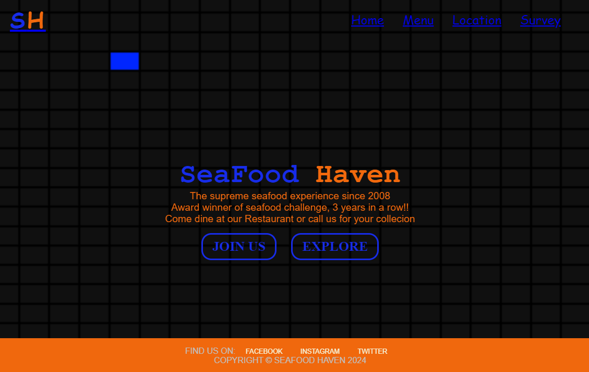
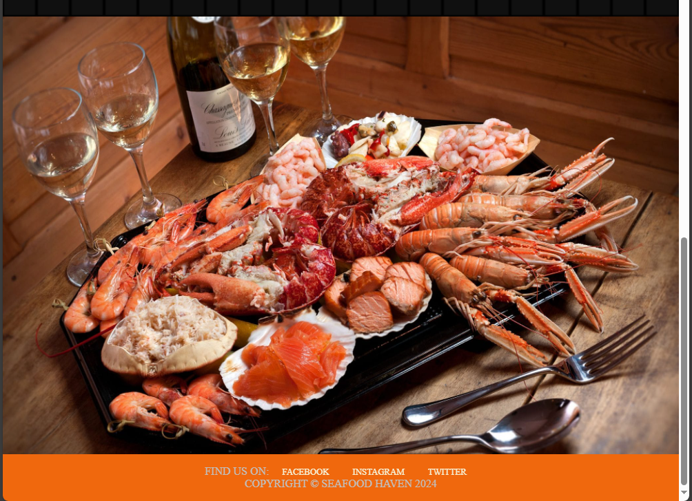
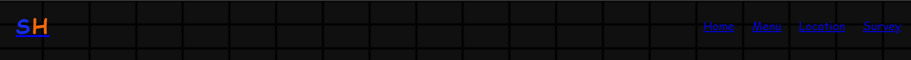
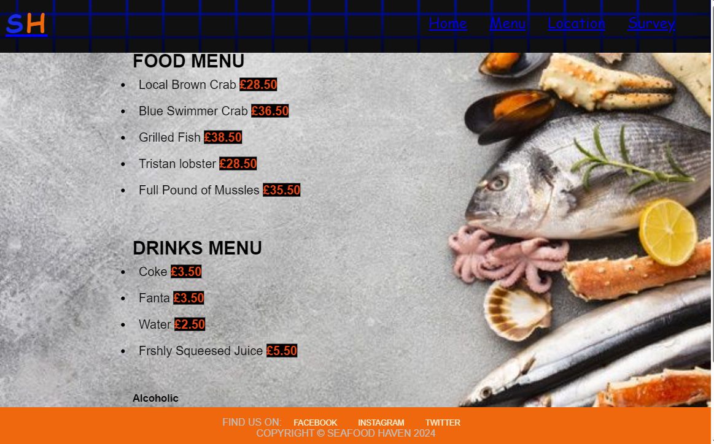
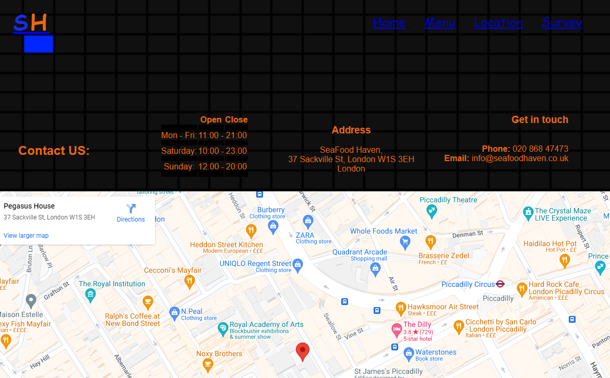
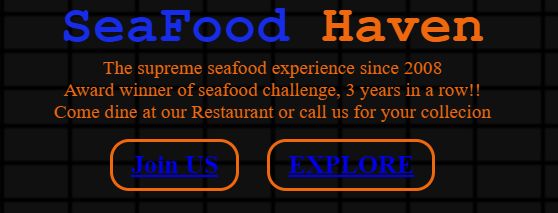
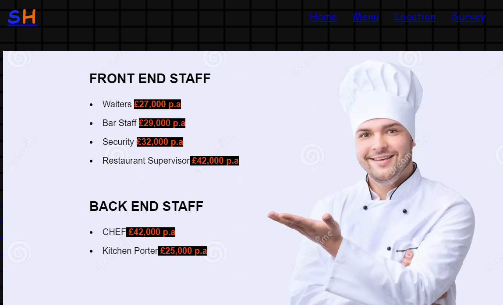
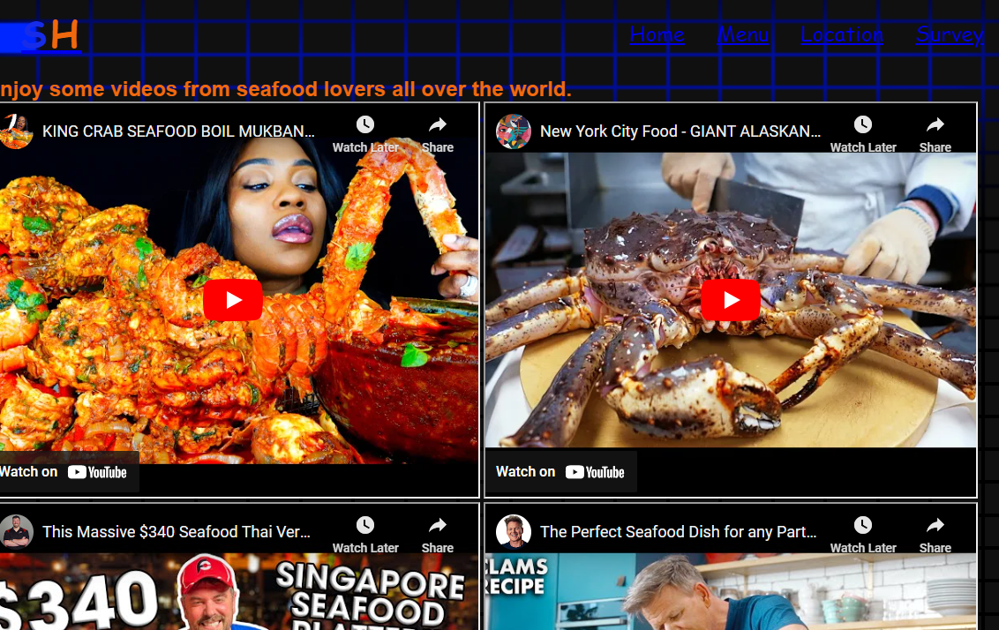
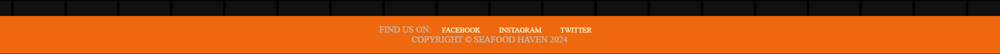

# SeaFood-Haven

Welcome to SeaFood Haven website where we will showcase what we offer and give you more details about our restaurant. We make all our food from fresh to order only using the finger licking ingredients. Our seafood is delivered everyday meaning we do not freeze our food and offer the freshest taste. 

We are proud to be the first authentic family run business in London and have achieved numerous awards over the years. We source our ingredients from all over the world making our seafood boil one of a kind. 

The URL of my website is: https://github.com/tbhub01/SeaFood-Haven.git

Below shows an image of the first thing you will see when you visit our website with an animated background:

## Features

Below we will discuss different parts of our website and how it achieves its 
purpose of giving out the required information to anyone who wishes t.
o0 know about SeaFood Haven.

- __Navigation Bar__

  - The Landing page has 3 additional pages and its found at the top right of every page. This are the menu, location and survey pages. 
   - Also on the landing page, there are 2 additional pages only featured on the landing page. This takes you to our current vacancies (Join US) and videos from seafood lovers all over the world (Explore) 
   - This allows the users to navigate from page to page and will not need to use the back button to get to the previous page. 

- __The Menu Section__
    - This section gives the users information about varities of food on offer on our menu.
    - Most people view the food and drinks menu before making their way to the restaurant and having a clear and easily readable menu is vital.
  

- __The Location Section__
  - The location section shows users of our website the contact details and full address of our restaurant.
  - We also attached a map pin-pointing the exact location of our restaurant. 
  

- __The Survey Section__
  - The survey section gives our customers the opportunity to share feedback on how the visit to our website went.
  - This feedback helps us to improve on our services which in turn keeps our customers happy and coming back. 
    

- __The Join US and Explore Section__
          

  - The join us section is where users of our website can find all our live job opportunities.
      
  - While the explore section is where seafood lovers can take time out and watch videos from seafood enthusiast, customers who made videos from visiting our restaurants and the preparation process for seafood. 
        

- __The Footer Section__
  -This are links to all our social media platform. They are located at the bottom of everypage.
        

## Testing

I have conducted intensive testing and ensured the users of this website can navigate form everypage without having to use the back button.

With the use of putting contents into container, I have been able to ensure that the iages or text do not disturt in different screen sizes. 

The main bugs during my testing phrase were minor error or a missed closed declaration which by th help of the validator to locate them I was able to sort them all out. 

### Validator Testing

  
  

